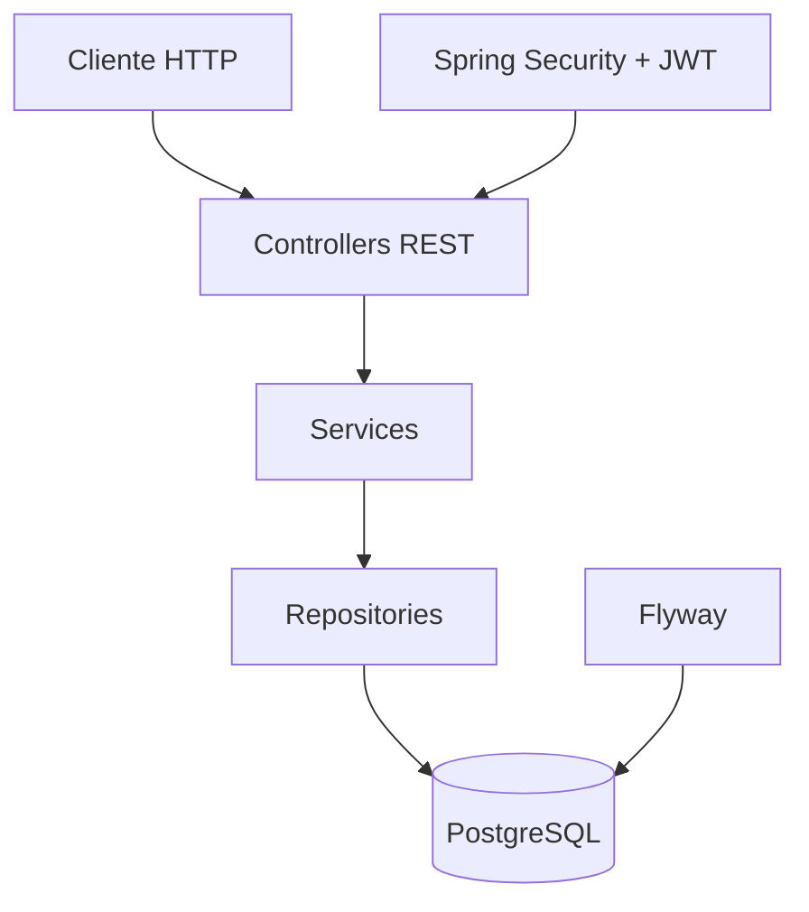

# ToDo Advanced with Spring Boot

API backend para gerenciamento de tarefas com autenticação JWT, cadastro de usuários e persistência em PostgreSQL. O projeto utiliza Spring Boot, Spring Security, Spring Data JPA e Flyway para controle do schema do banco de dados.

## Tecnologias

- Java 21
- Spring Boot 4.0.6
- Spring Web MVC
- Spring Data JPA
- Spring Security
- Spring Validation
- Hibernate
- PostgreSQL
- Flyway
- Java JWT (`com.auth0:java-jwt`)
- Springdoc OpenAPI / Swagger UI
- Lombok
- Maven
- Docker
- Docker Compose
- JUnit 5

## Funcionalidades

- Cadastro de usuários.
- Login com geração de token JWT.
- Autenticação stateless com Bearer Token.
- Autorização por roles `USER` e `ADMIN`.
- Consulta de informações do usuário autenticado.
- Consulta de usuário por nome em rota restrita a administradores.
- CRUD de tarefas.
- Listagem de tarefas vinculadas ao usuário autenticado.
- Marcação de tarefa como concluída.
- Marcação de tarefa como favorita.
- Validação de dados de entrada.
- Tratamento centralizado de erros.
- Migração de banco de dados com Flyway.
- Documentação interativa da API com Swagger UI.

## Arquitetura

Este é um projeto backend organizado em camadas, seguindo uma estrutura comum em aplicações Spring Boot:

- `controller`: expõe os endpoints REST.
- `service`: concentra regras de negócio e integração com autenticação.
- `repository`: abstrai o acesso ao banco de dados com Spring Data JPA.
- `entity`: representa as entidades persistidas.
- `dto`: define contratos de entrada e saída da API.
- `mapper`: converte entidades em DTOs de resposta.
- `configs`: configura segurança, CORS, autenticação e autorização.
- `exception`: centraliza exceções e respostas de erro.



## Instalação

Clone o repositório:

```bash
git clone https://github.com/FabioCoutinho1/ToDo-Advanced-with-Spring-Boot.git
cd ToDo-Advanced-with-Spring-Boot
```

Garanta que o ambiente possua:

- Java 21 ou superior.
- Docker e Docker Compose, caso utilize execução containerizada.
- PostgreSQL, caso execute a aplicação sem Docker.

## Variáveis de ambiente

As variáveis abaixo são utilizadas pelos arquivos de configuração da aplicação e pelo `docker-compose.yml`:

```env
ACTIVE_PROFILE=dev
SPRING_PROFILES_ACTIVE=default
DB_URL=jdbc:postgresql://localhost:5432/estudos
DB_USERNAME=postgres
DB_PASSWORD=postgres
JWT_SECRET=mysecretkey
POSTGRES_USER=postgres
POSTGRES_PASSWORD=postgres
POSTGRES_DB=estudos
```

Observações:

- `ACTIVE_PROFILE` é lida em `application.properties` para definir o profile ativo, com valor padrão `dev`.
- `SPRING_PROFILES_ACTIVE` é utilizada no `docker-compose.yml`.
- `JWT_SECRET` possui valor padrão `mysecretkey`, mas deve ser alterada em ambientes reais.
- Em execução local com o profile `dev`, a aplicação utiliza a porta `3001`.
- Em execução via Docker Compose, a aplicação expõe a porta `3000`.

## Executando o projeto

### Execução local

Configure as variáveis de ambiente do banco de dados e execute:

```bash
./mvnw spring-boot:run
```

Com o profile `dev`, a API ficará disponível em:

```text
http://localhost:3001
```

### Execução com Docker Compose

Para subir a API e o PostgreSQL:

```bash
docker compose up --build
```

A API ficará disponível em:

```text
http://localhost:3000
```

O PostgreSQL será iniciado com:

```text
Host: localhost
Porta: 5432
Banco: estudos
Usuário: postgres
Senha: postgres
```

## Endpoints da API

Rotas protegidas exigem o cabeçalho:

```http
Authorization: Bearer <token>
```

### Autenticação e Usuários

- `POST /user/register` → Cadastrar um usuário e retornar um token JWT.
- `POST /user/login` → Autenticar um usuário e retornar um token JWT.
- `GET /user/infouser` → Retornar informações do usuário autenticado.
- `GET /user/admin/{name}` → Buscar usuário por nome. Requer role `ADMIN`.

#### Exemplo de cadastro

```json
{
  "userName": "usuario",
  "password": "123456"
}
```

#### Exemplo de login

```json
{
  "userName": "usuario",
  "password": "123456"
}
```

### Tarefas

- `GET /task` → Listar tarefas do usuário autenticado.
- `GET /task/{id}` → Buscar uma tarefa por id.
- `POST /task` → Criar uma nova tarefa para o usuário autenticado.
- `PUT /task/{id}` → Atualizar nome, status de conclusão e/ou favorito de uma tarefa.
- `DELETE /task/{id}` → Remover uma tarefa.

#### Exemplo de criação de tarefa

```json
{
  "name": "Estudar Spring Boot"
}
```

#### Exemplo de atualização de tarefa

```json
{
  "name": "Estudar Spring Security",
  "done": true,
  "favorite": true
}
```

## Estrutura do Projeto

```text
.
├── Dockerfile
├── docker-compose.yml
├── mvnw
├── mvnw.cmd
├── pom.xml
└── src
    ├── main
    │   ├── java
    │   │   └── com
    │   │       └── estudo
    │   │           └── todo
    │   │               ├── DemoApplication.java
    │   │               ├── exception
    │   │               └── module
    │   │                   ├── auth
    │   │                   │   ├── configs
    │   │                   │   └── service
    │   │                   ├── task
    │   │                   │   ├── controller
    │   │                   │   ├── dto
    │   │                   │   ├── entity
    │   │                   │   ├── mapper
    │   │                   │   ├── repository
    │   │                   │   └── service
    │   │                   └── user
    │   │                       ├── controller
    │   │                       ├── dto
    │   │                       ├── entity
    │   │                       ├── repository
    │   │                       ├── services
    │   │                       └── userRole
    │   └── resources
    │       ├── application-dev.properties
    │       ├── application.properties
    │       └── db
    │           └── migration
    └── test
        └── java
            └── com
                └── Estudo
                    └── todo
```

## Testes

Execute os testes com Maven:

```bash
./mvnw test
```

O projeto possui um teste de carregamento de contexto da aplicação Spring Boot em `DemoApplicationTests`.

## Documentação da API

O projeto utiliza Springdoc OpenAPI com Swagger UI.

Com execução local no profile `dev`:

[http://localhost:3001/swagger-ui/index.html](http://localhost:3001/swagger-ui/index.html)

Com execução via Docker Compose:

[http://localhost:3000/swagger-ui/index.html](http://localhost:3000/swagger-ui/index.html)

## Screenshots

Não foram encontradas imagens, pasta `docs`, `images` ou `screenshots` no repositório.

## Deploy

O projeto possui suporte a containerização com `Dockerfile` e `docker-compose.yml`.

### Build da imagem Docker

```bash
docker build -t todo-advanced-spring-boot .
```

### Execução do container

```bash
docker run --rm -p 3000:3000 \
  -e DB_URL=jdbc:postgresql://host.docker.internal:5432/estudos \
  -e DB_USERNAME=postgres \
  -e DB_PASSWORD=postgres \
  -e JWT_SECRET=mysecretkey \
  todo-advanced-spring-boot
```

Para deploy em plataformas como Render, Railway ou similares, configure uma instância PostgreSQL e informe as variáveis `DB_URL`, `DB_USERNAME`, `DB_PASSWORD` e `JWT_SECRET` conforme o ambiente.

## Melhorias Futuras

- Adicionar testes unitários para services e controllers.
- Adicionar testes de integração para autenticação e CRUD de tarefas.
- Revisar autorização nas operações de atualização e remoção de tarefas para garantir vínculo com o usuário autenticado.
- Padronizar códigos de resposta HTTP, como `201 Created` para criação de recursos.
- Adicionar exemplos completos de resposta da API na documentação.
- Configurar ambientes separados para desenvolvimento, testes e produção.
- Adicionar pipeline de CI para build e testes automatizados.

## Autor

Fabio Farias Coutinho

- GitHub: [FabioCoutinho1](https://github.com/FabioCoutinho1)
